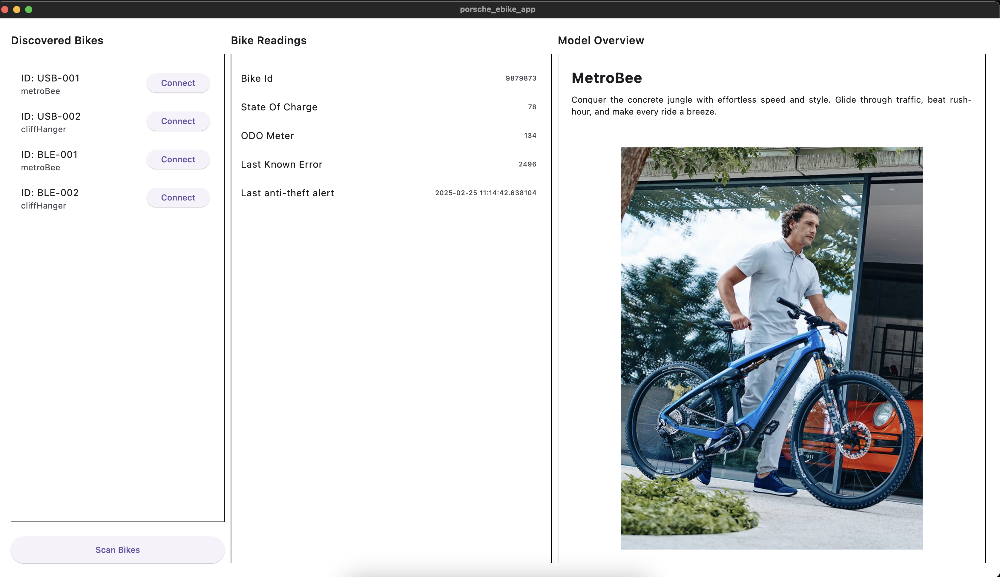
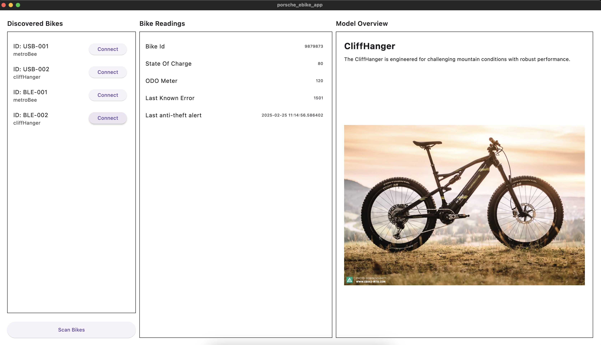

# Flutter macOS Project

This project is a Flutter macOS application designed to interface with Bluetooth Low Energy (BLE) devices and USB serial devices. It uses various packages to manage state, handle permissions, and manage dependencies, making the app extensible for both macOS and Android platforms.

### Technologies Used:
- **Flutter** (for cross-platform development)
- **Mockito** (for unit testing)
- **flutter_blue_plus** (for BLE communication)
- **usb_serial** (for USB communication)
- **Riverpod** & **Provider** (for state management and dependency injection)
- **Get_it** (for dependency injection)
- **Permission Handler** (for handling permissions)
- **Shared Preferences** (for persisting data)

### Project Features:
- **Bluetooth and USB Device Connectivity**: Mocked connections for future integration with real devices.
- **Device Detection**: Displays detected devices with a **Connect** button next to each device.
- **Extensible for Android Development**: This project is designed to be easily extendable for Android with platform-specific logic.
- **UI Improvements**: Added a **Connect** button next to each detected bike for better user interaction.
- **Testing**: Thoroughly tested on macOS with a strong focus on unit and widget testing using **Mockito**.

### Screenshots:



### Local Setup

1. **Install Dependencies**:
   Before running the project, ensure that the following dependencies are installed on your local machine:

   - **Flutter**: Ensure you have Flutter installed on your machine. Follow the installation instructions here: [Flutter Installation Guide](https://flutter.dev/docs/get-started/install).
   - **Xcode**: Required for macOS development. Install via the Mac App Store or from the [Xcode website](https://developer.apple.com/xcode/).
   - **Android Studio (Optional)**: If you intend to extend the project for Android development, install Android Studio from [here](https://developer.android.com/studio).
   - **CocoaPods**: Required for managing iOS dependencies. Install using the following command:
     ```bash
     sudo gem install cocoapods
     ```

2. **Install Flutter Dependencies**:
   Navigate to your project folder and run:
   ```bash
   flutter pub get

3. **Running the Project**:
   Navigate to your project folder and run:
   ```bash
   flutter run -d macos

4. **Generate Mocks for Testing**:
   If you haven't generated mocks yet, run:
   ```bash
   flutter pub run build_runner build

5. **Testing**:
   To run the tests, use:
   ```bash
   flutter test

### Extendability for Android:
While this project has been tested thoroughly on macOS, it is designed to be easily extendable for Android. You can integrate the necessary platform-specific logic (such as Bluetooth and USB serial communication) for Android by implementing the required methods in platform_channel and modifying platform-specific code in android directory.

### Known Limitations:
The USB and BLE connections are currently mocked for future development.
Some Android-specific features have not been implemented yet.

### Note-To-Reviewer:
***Some tests are not passing but I have added implementation in the project for your consideration. 
